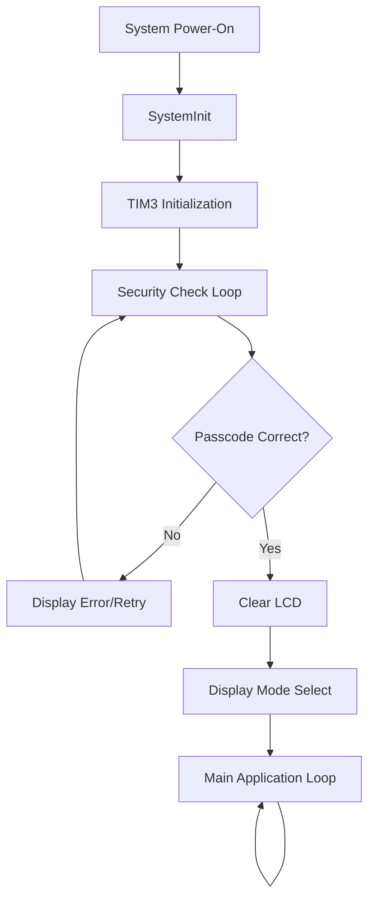

# Real_time_industrial_safety
# 

A security authentication system built on the STM32F4xx microcontroller platform. This project implements a passcode-based access control system with LCD display feedback and button input interface.

## Overview

This system provides a secure login mechanism that blocks system operation until the correct passcode is entered. It features modular code organization with separate modules for security logic, testing, and LCD display control.

## Features

- **Passcode Authentication**: Button-based code entry system
- **LCD Feedback**: Real-time display of system status and prompts
- **Timer-Based Delays**: Hardware timer (TIM3) for precise timing
- **Modular Architecture**: Separated security, display, and testing modules
- **System Lockout**: Blocks main application until authentication succeeds

## Hardware Requirements

### Microcontroller
- **STM32F4xx Series**
- ARM Cortex-M4 core

### User Interface
- **16x2 LCD Display**: Character display for status messages and prompts
- **Push Buttons**: Input interface for passcode entry
- **GPIO Pins**: Configured for button inputs with appropriate pull-up/pull-down resistors

## Software Architecture

### Project Structure

```
├── main.c              # Main application entry point
├── lcd.c / lcd.h       # LCD driver and control functions
├── secq.c / secq.h     # Security and authentication logic
├── test.c / test.h     # Testing and utility functions
└── stm32f4xx.h         # STM32F4 HAL/CMSIS header
```

### Module Descriptions

#### Main Module (`main.c`)
- **System Initialization**: Configures system clock via `SystemInit()`
- **Timer Setup**: Initializes TIM3 for delay functions
- **Security Gate**: Calls `security_check_loop()` to enforce authentication
- **Post-Login**: Displays mode selection screen after successful login

#### Security Module (`secq.c/h`)
Key functions:
- `security_check_loop()`: Main authentication loop that blocks until correct code
- `check_code()`: Validates entered passcode
- `display_code()`: Shows current code input on LCD
- `read_button()`: Reads button state from GPIO
- `buttons_gpio_init()`: Configures GPIO pins for button inputs

#### LCD Module (`lcd.c/h`)
- LCD initialization and configuration
- Character and string display functions
- Command execution (clear, cursor position, etc.)

#### Timer Module (TIM3)
- `tim3_init()`: Configures Timer 3 for millisecond delays
- `delay_timer_ms(uint32_t ms)`: Hardware-based delay function

#### Test Module (`test.c/h`)
- Testing utilities and debug functions
- System validation routines

## Operation Flow



### Startup Sequence

1. **System Initialization**
   ```c
   SystemInit();   // CMSIS system clock configuration
   tim3_init();    // Initialize Timer 3 for delays
   ```

2. **Security Authentication**
   ```c
   security_check_loop();  // Blocks until correct passcode
   ```
   - Prompts user for passcode entry
   - Reads button inputs
   - Validates code
   - Provides feedback via LCD
   - Repeats until authentication succeeds

3. **Post-Login Operation**
   ```c
   lcd(0x01, 0);           // Clear display
   lcd_string("Mode Select");
   while(1) { /* Main loop */ }
   ```

## Key Functions

### Security Functions

#### `security_check_loop(void)`
Main authentication loop that:
- Displays passcode entry prompt
- Captures button inputs
- Validates entered code
- Loops until correct passcode is provided

#### `check_code(void)`
Returns:
- `1` if passcode matches stored code
- `0` if passcode is incorrect

#### `display_code(void)`
Updates LCD with current passcode entry state (typically shows asterisks or numbers).

#### `read_button(GPIO_TypeDef *port, uint16_t pin_mask)`
Parameters:
- `port`: GPIO port (e.g., GPIOA, GPIOB)
- `pin_mask`: Pin bitmask (e.g., GPIO_PIN_0)

Returns:
- `1` if button is pressed
- `0` if button is not pressed

#### `buttons_gpio_init(void)`
Configures GPIO pins for button inputs:
- Sets pin mode (input)
- Configures pull-up/pull-down resistors
- Enables GPIO clock

### Timer Functions

#### `tim3_init(void)`
Initializes Timer 3 for millisecond-precision delays:
- Configures prescaler for 1ms tick
- Enables timer interrupt (if applicable)
- Starts timer counter

#### `delay_timer_ms(uint32_t ms)`
Hardware-based delay function:
- More accurate than software delays
- Non-blocking alternative available if needed
- Uses TIM3 for timing

### LCD Functions

#### `lcd(uint8_t data, uint8_t rs)`
Sends data/command to LCD:
- `data`: Byte to send
- `rs`: 0 for command, 1 for data

#### `lcd_string(char *str)`
Displays null-terminated string on LCD.

## Configuration

### GPIO Pin Assignment (Example)

| Component | Port | Pin | Mode | Pull |
|-----------|------|-----|------|------|
| Button 1 | GPIOA | PA0 | Input | Pull-Up |
| Button 2 | GPIOA | PA1 | Input | Pull-Up |
| Button 3 | GPIOA | PA2 | Input | Pull-Up |
| Button 4 | GPIOA | PA3 | Input | Pull-Up |
| LCD RS | GPIOB | PB0 | Output | - |
| LCD EN | GPIOB | PB1 | Output | - |
| LCD D4-D7 | GPIOB | PB4-7 | Output | - |

*Note: Actual pin assignments should be defined in `secq.h` or hardware configuration file.*

### Passcode Configuration

Default passcode should be defined in `secq.c`:
```c
#define DEFAULT_PASSCODE "1234"  // Example 4-digit code
```

### Timer Configuration

TIM3 setup for 1ms tick (assuming 84 MHz APB1 clock):
```c
void tim3_init(void) {
    RCC->APB1ENR |= RCC_APB1ENR_TIM3EN;
    TIM3->PSC = 84000 - 1;  // 84MHz / 84000 = 1kHz (1ms)
    TIM3->ARR = 0xFFFF;     // Max counter value
    TIM3->CR1 |= TIM_CR1_CEN;  // Enable counter
}
```

## Building and Flashing

### Prerequisites
- **IDE**: STM32CubeIDE, Keil MDK, or IAR Embedded Workbench
- **Toolchain**: ARM GCC Compiler
- **Programmer**: ST-LINK/V2 or compatible

### Build Instructions

#### Using STM32CubeIDE
```bash
1. File → Import → Existing Projects into Workspace
2. Select project directory
3. Project → Build All (Ctrl+B)
4. Run → Debug (F11) to flash and debug
```

#### Using Command Line (ARM GCC)
```bash
# Compile
arm-none-eabi-gcc -mcpu=cortex-m4 -mthumb -O2 \
  -DSTM32F407xx -c main.c lcd.c secq.c test.c

# Link
arm-none-eabi-gcc -mcpu=cortex-m4 -mthumb \
  -T STM32F407VG_FLASH.ld \
  main.o lcd.o secq.o test.o -o security_system.elf

# Convert to binary
arm-none-eabi-objcopy -O binary security_system.elf security_system.bin

# Flash using st-flash
st-flash write security_system.bin 0x8000000
```

## Usage

### Initial Setup
1. Power on the STM32 board
2. LCD displays security prompt (e.g., "Enter Code:")
3. Use buttons to enter passcode digits
4. Press confirm button (implementation-specific)

### Passcode Entry
- Each button press registers a digit
- LCD updates to show entry progress (typically as asterisks)
- System validates after final digit/confirmation

### Authentication Success
- LCD displays success message
- System clears display
- Shows "Mode Select" prompt
- Transitions to main application

### Authentication Failure
- LCD displays error message (e.g., "Wrong Code!")
- System prompts for retry
- Remains in security loop

## Customization

### Changing Passcode Length
In `secq.c`:
```c
#define PASSCODE_LENGTH 4  // Change to desired length
```

### Adding Lockout Timer
Implement attempt counter with delay:
```c
uint8_t attempts = 0;
if (attempts >= 3) {
    lcd_string("Locked!");
    delay_timer_ms(30000);  // 30-second lockout
    attempts = 0;
}
```

### Adding Visual Feedback
```c
// Blink LED on wrong code
void indicate_error(void) {
    for(int i = 0; i < 3; i++) {
        GPIOD->ODR ^= GPIO_PIN_12;  // Toggle LED
        delay_timer_ms(200);
    }
}
```

## Troubleshooting

### LCD Not Displaying
- Check LCD power supply (5V or 3.3V depending on module)
- Verify contrast adjustment (potentiometer)
- Confirm GPIO pin connections
- Check initialization sequence timing

### Buttons Not Responding
- Verify GPIO clock is enabled
- Check pull-up/pull-down configuration
- Test with multimeter for continuity
- Add debounce delay: `delay_timer_ms(50);`

### System Hangs in Security Loop
- Verify `check_code()` logic
- Add debug output to LCD
- Check if passcode comparison is case-sensitive
- Ensure button read functions work correctly

### Timer Not Working
- Confirm TIM3 clock is enabled
- Check prescaler calculation for your clock speed
- Verify APB1 clock frequency
- Test with known delay and oscilloscope

## Security Considerations

⚠️ **Important Notes:**
- This is a basic authentication system for learning purposes
- Not suitable for high-security applications without enhancements
- Passcode stored in plaintext (consider hashing)
- No protection against brute force attacks
- Susceptible to timing attacks

### Recommended Enhancements
- [ ] Implement attempt limiting with exponential backoff
- [ ] Add cryptographic hash for passcode storage
- [ ] Use secure element for key storage (e.g., ATECC608)
- [ ] Implement encrypted communication
- [ ] Add tamper detection
- [ ] Log authentication attempts

## Future Enhancements

- [ ] Multi-user support with individual passcodes
- [ ] EEPROM storage for passcode persistence
- [ ] Biometric authentication (fingerprint sensor)
- [ ] RFID card reader integration
- [ ] Wireless authentication (Bluetooth/NFC)
- [ ] Remote passcode change via UART/USB
- [ ] Time-based one-time passwords (TOTP)
- [ ] Audit log with RTC timestamps

## Example Applications

- Secure door lock system
- Equipment access control
- Laboratory instrument protection
- Industrial machine safety interlock
- Personal safe/vault controller
- Vehicle immobilizer system

## Contributing

Contributions are welcome! Please follow these guidelines:
1. Fork the repository
2. Create feature branch (`git checkout -b feature/enhancement`)
3. Commit changes (`git commit -m 'Add new feature'`)
4. Push to branch (`git push origin feature/enhancement`)
5. Open Pull Request

## License

This project is open-source and available under the MIT License.

## References

- [STM32F4 Reference Manual](https://www.st.com/resource/en/reference_manual/dm00031020.pdf)
- [STM32F4 HAL Documentation](https://www.st.com/en/embedded-software/stm32cubef4.html)
- HD44780 LCD Controller Datasheet

## Author

GitHub: [@muskum09ari](https://github.com/muskum09ari)

---

**Project Type**: Educational/Embedded Systems  
**Complexity**: Intermediate  
**Last Updated**: December 2025
